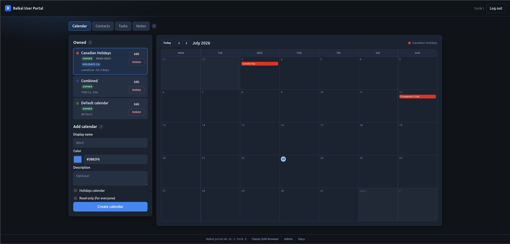
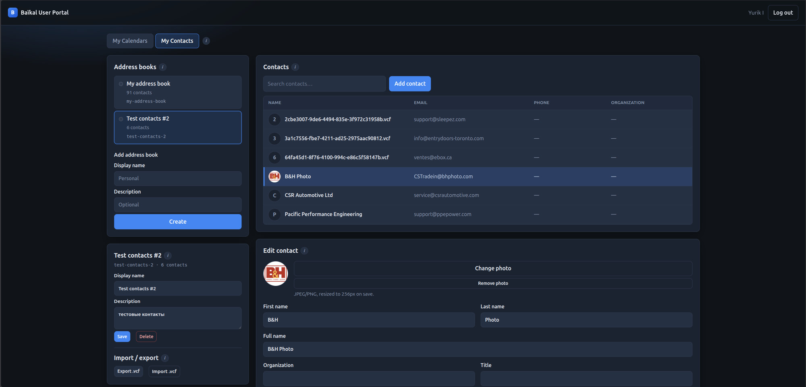
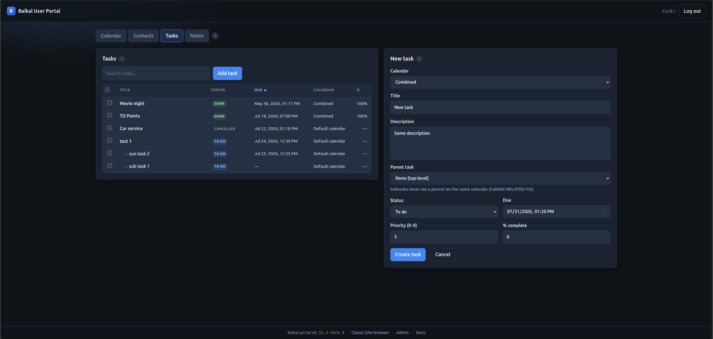
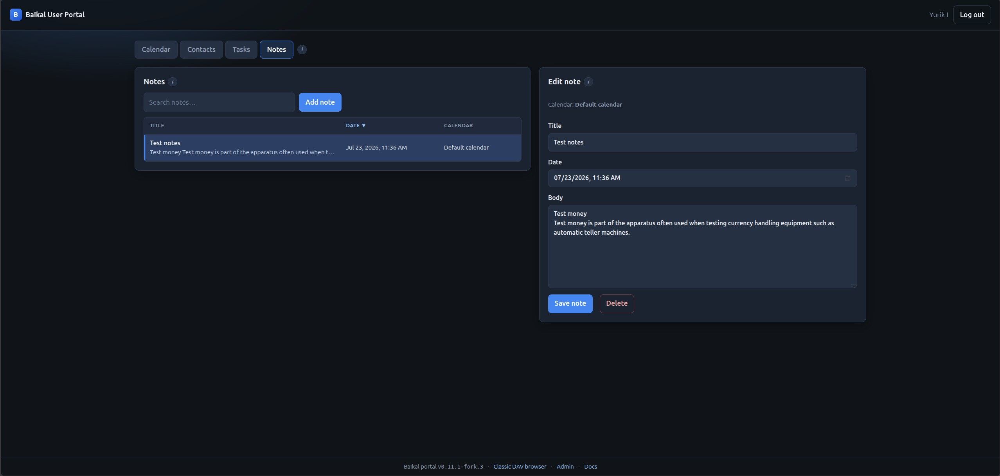

Baïkal (fork) · 0.11.1-fork.4
=============================

[](https://github.com/offsyanka99/Baikal/actions/workflows/ci.yml)
[](https://github.com/offsyanka99/Baikal/actions/workflows/docker.yml)

Fork of the [Baïkal](https://sabre.io/baikal/) CalDAV + CardDAV server based on upstream **0.11.1**, with packaging and UX for self-hosted / TrueNAS deployments.

**This release:** `0.11.1-fork.4` (not an upstream sabre-io tag).  
**Docs:** [docs/](docs/) · [Deployment](docs/DEPLOYMENT.md) · [TrueNAS compose](docs/truenas-scale.compose.yaml)

Fork of Baïkal with:

- **Docker** image and **TrueNAS SCALE** compose
- **GHCR** multi-arch images: `ghcr.io/offsyanka99/baikal`
- Admin hardening (`password_hash`, session timeout, login rate limit)
- System settings for **Tasks (VTODO)** and **Notes (VJOURNAL)**
- `/health.php` and `/info.php` for monitoring
- CalDAV **calendar-timezone** dual-format fix (plain Olson id + VTIMEZONE) for Home Assistant expand queries
- **User portal** (`/portal/`) — TypeScript SPA + PHP API:
  - **Calendar** tab: owned list (Edit / Delete), month event grid, create/edit/delete events (incl. RRULE), holidays/read-only, details/share/import/export in modal
  - **Contacts** tab: address books (CRUD + delete confirm), contact list/search/edit, multi email/phone, photos, birthday/special dates, per-contact and book `.vcf` export
  - **Tasks** / **Notes** tabs: CalDAV `VTODO` / `VJOURNAL` (bulk actions on tasks)
  - Info **(i)** modals instead of long inline help; optional 12h/24h and week-start prefs
- `/dav.php/` kept as classic backup browser and CalDAV/CardDAV endpoint

Upstream project: [sabre-io/Baikal](https://github.com/sabre-io/Baikal).  
Official docs: [sabre.io/baikal](https://sabre.io/baikal/).

Versioning
----------

| Version | Meaning |
|---------|---------|
| `0.11.1` | Upstream Baikal line this fork is based on |
| `0.11.1-fork.1` | First packaged release (portal v1, HA timezone, Docker/TrueNAS) |
| `0.11.1-fork.2` | Portal calendars/contacts polish: import/export, holidays, tabs, UI |
| `0.11.1-fork.3` | Full portal contacts CRUD, CalDAV read-only plugin, portal security hardening |
| `0.11.1-fork.4` | Portal event CRUD/RRULE, single-contact export, bulk-bar UX, portal UI prefs |

Image tags: `latest`, `0.11.1-fork.4`, `sha-…`.

Quick start (Docker)
--------------------

```bash
docker pull ghcr.io/offsyanka99/baikal:0.11.1-fork.4
# or: ghcr.io/offsyanka99/baikal:latest
docker run -d --name baikal -p 8080:80 \
  -v baikal-config:/var/www/baikal/config \
  -v baikal-data:/var/www/baikal/Specific \
  ghcr.io/offsyanka99/baikal:0.11.1-fork.4
```

Then open http://127.0.0.1:8080/ and run the installer.

TrueNAS SCALE
-------------

Use [`docs/truenas-scale.compose.yaml`](docs/truenas-scale.compose.yaml)  
(Apps → Custom App → Install via YAML). Full notes: [`docs/DEPLOYMENT.md`](docs/DEPLOYMENT.md).

Endpoints
---------

| Path | Use |
|------|-----|
| `/portal/` | **User portal** — calendars, contacts, tasks, notes |
| `/dav.php/` | CalDAV + CardDAV (clients + classic WebDAV browser) |
| `/admin/` | Web admin |
| `/api/` | Portal JSON API (session cookie) |
| `/health.php` | Liveness JSON |
| `/info.php` | Public status JSON |

User portal
-----------

1. Admin creates DAV users under `/admin/`.
2. Open **`/portal/`**, sign in with **DAV** credentials.
3. **Calendar:** owned list, month view, create/edit events (repeat rules), Edit modal (details, share, import/export `.ics`).
4. **Contacts:** address books, contact search/CRUD, photos, birthday/special dates, custom fields, import/export `.vcf`.
5. **Tasks** / **Notes:** manage `VTODO` / `VJOURNAL` on your calendars.









More detail: [`docs/DEPLOYMENT.md`](docs/DEPLOYMENT.md#user-portal).  
`/dav.php/` remains available as the original sabre browser (and for all CalDAV/CardDAV clients).

Home Assistant
--------------

Point the CalDAV integration at `http(s)://host/dav.php/` (or `/cal.php/`).
This fork accepts Baikal’s plain calendar timezone ids on expand queries, so
you do **not** need ckulka’s `APPLY_HOME_ASSISTANT_FIX` env var. Details:
[`docs/DEPLOYMENT.md`](docs/DEPLOYMENT.md#home-assistant--calendar-timezone).

Upgrading from upstream Baikal
------------------------------

Follow [upstream upgrade instructions](https://sabre.io/baikal/upgrade/).  
Admin passwords using the old SHA-256 scheme are upgraded automatically on next successful login.

After `composer install` / `composer update`, vendor patches (including the
calendar-timezone fix) are applied automatically via
[`scripts/apply-vendor-patches.sh`](scripts/apply-vendor-patches.sh).

Changelog (fork)
----------------

### 0.11.1-fork.4

- Calendar **event CRUD** from the month grid (create / edit / delete VEVENT), including **RRULE** (daily/weekly/monthly/yearly, until/count, by-day)
- **Single-contact export** `.vcf` from the contact editor; address-book delete uses a checkbox confirmation modal (same pattern as calendars)
- Contact **birthday** and **special date** fields; Calendar details modal order: Share then Import/export
- Tasks bulk bar: green apply icons, Delete / Clear selection on a second row
- Portal UI prefs: `portal_time_format` / `portal_week_start` in `baikal.yaml` (or `TIME_FORMAT` / `BAIKAL_PORTAL_*` env)

### 0.11.1-fork.3

- Portal **My Contacts**: address book create/rename/delete; contact list (table), search, create/edit/delete
- Multi email/phone, structured address, photos (vCard 3.0 JPEG), Unicode custom fields (`X-BAIKAL-CUSTOM`)
- **ReadOnlyPlugin**: portal read-only calendars enforced on CalDAV (`PUT`/`DELETE`/… → 403)
- Portal security: login rate limit, session idle timeout, CSRF + same-origin, import quotas, UTF-8-safe API JSON
- Docker: `php8.2-gd`, CSP headers; production portal builds without source maps
- Calendar month grid, Edit/Delete + details/share modal; Tasks/Notes tabs; bulk task actions
- Docs: updated Calendar, Tasks, Notes screenshots and deployment notes

### 0.11.1-fork.2

- Portal tabs: **My Calendars** / **My Contacts**
- Calendar import/export (`.ics`), including large Thunderbird exports (timeouts raised)
- Holidays calendar option (country picker, Nager.Date) + read-only flag
- Contacts import/export (`.vcf`)
- Info **(i)** modals for section help; left column layout / badge overlap fixes
- Import result messages in the UI

### 0.11.1-fork.1

- User portal at `/portal/` (bookmarks-sync style UI) + `/api/` session API
- Calendar create/edit: display name, color, description
- Calendar sharing with other Baikal users (read / full access)
- Dual-format `calendar-timezone` for Home Assistant expand queries
- Docker/GHCR multi-arch, TrueNAS compose, health/info endpoints
- Admin hardening and Tasks/Notes system flags

Credits
-------

Baikal was created by [Jérôme Schneider](https://github.com/jeromeschneider) from Net Gusto and [fruux](https://fruux.com/) and is maintained by volunteers. This fork adds packaging, hardening, user portal, and Home Assistant–friendly CalDAV timezone handling for self-hosted / TrueNAS deployments.
