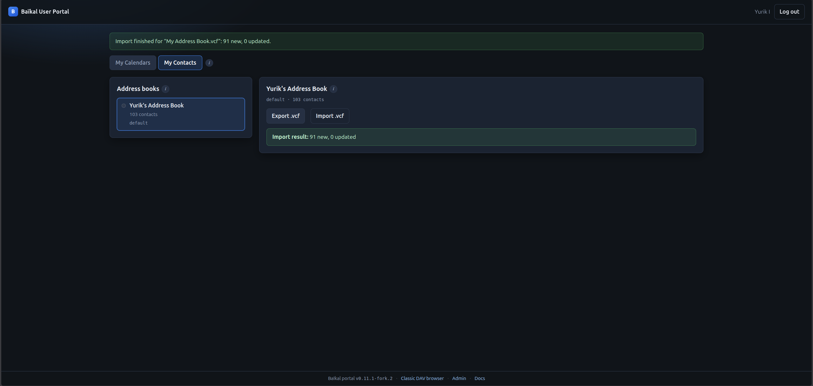

# Deployment guide (fork)

**Version:** `0.11.1-fork.2` (based on upstream Baikal 0.11.1)

This fork packages [Baïkal](https://sabre.io/baikal/) for Docker and TrueNAS SCALE, and adds admin hardening, system Tasks/Notes flags, health endpoints, a dual-format CalDAV calendar-timezone fix for Home Assistant, and a **user portal** for calendars and contacts.

## Images

| Image | When |
|-------|------|
| `ghcr.io/offsyanka99/baikal:0.11.1-fork.2` | **Pin for production** (this release) |
| `ghcr.io/offsyanka99/baikal:latest` | Default tracking `master` (GitHub Actions) |
| `ghcr.io/offsyanka99/baikal:sha-…` | Pin to a git SHA |
| Build from `Dockerfile` | Dev / offline packaging |

Multi-arch: `linux/amd64`, `linux/arm64`.

## TrueNAS SCALE

See [`truenas-scale.compose.yaml`](truenas-scale.compose.yaml).

1. Create dataset dirs and `chown -R 101:101` (nginx UID in the image).
2. Install via Custom App YAML.
3. Complete the web installer once.
4. Put **HTTPS** in front (TrueNAS proxy, Caddy, Traefik). Do not expose plain HTTP to the internet.

### Volumes to back up

| Mount | Contents |
|-------|----------|
| `/var/www/baikal/config` | `baikal.yaml` (admin password hash, CalDAV/CardDAV/Tasks/Notes flags, auth) |
| `/var/www/baikal/Specific` | SQLite DB, `INSTALL_DISABLED`, admin login rate-limit state |

## Endpoints

| Path | Purpose |
|------|---------|
| `/portal/` | **User portal** (calendars + contacts; DAV user login) |
| `/api/` | Portal JSON API (session cookie; same origin as SPA) |
| `/health.php` | Liveness JSON (`status`, `version`, install lock) |
| `/info.php` | Public feature flags (no secrets) |
| `/dav.php/` | Combined CalDAV + CardDAV + classic browser UI |
| `/cal.php/` | CalDAV only |
| `/card.php/` | CardDAV only |
| `/admin/` | Web admin |

## User portal

Modern UI (TypeScript SPA, dark theme aligned with bookmarks-sync admin style) for **end users**.  
Tabs: **My Calendars** · **My Contacts**. Section help is under **(i)** icons.

| Step | Action |
|------|--------|
| 1 | Open `http://NAS-IP:31088/portal/` |
| 2 | Sign in with a **DAV user** (created in Admin → Users), not the admin password |
| 3 | **My Calendars:** add/edit calendars, holidays, share, import/export `.ics` |
| 4 | **My Contacts:** select address book, import/export `.vcf` |

### Screenshots

**My Calendars** — owned calendars, holidays / read-only badges, edit details, import/export `.ics`, share:


**My Contacts** — address books, import/export `.vcf`, import result banner:



- Backend: PHP API under `/api/` (session cookie; sabre CalDAV/CardDAV backends).
- Frontend source: [`portal/`](../portal/) (Vite + TypeScript); image build compiles into `html/portal/`.
- Footer **Docs** → [github.com/offsyanka99/Baikal/tree/master/docs](https://github.com/offsyanka99/Baikal/tree/master/docs).
- **`/dav.php/` is unchanged** — CalDAV/CardDAV for clients and classic browser backup.
- Portal meta (read-only / holidays flags): `Specific/portal_meta.json` (include in backups).

### API (summary)

| Method | Path | Purpose |
|--------|------|---------|
| POST | `/api/login` | DAV user session |
| GET | `/api/calendars` | List calendars |
| POST | `/api/calendars` | Create (`displayname`, `color?`, `description?`, `holidays?`, `holidayCountry?`, `readOnly?`) |
| PATCH | `/api/calendars/{id}` | Update name / color / description |
| GET | `/api/calendars/{id}/export` | Download `.ics` |
| POST | `/api/calendars/{id}/import` | Import `.ics` body `{ics}` |
| POST/DELETE | `/api/calendars/{id}/shares` | Share / revoke |
| GET | `/api/addressbooks` | List address books |
| GET | `/api/addressbooks/{id}/export` | Download `.vcf` |
| POST | `/api/addressbooks/{id}/import` | Import `.vcf` body `{vcf}` |
| GET | `/api/holidays/countries` | Country list for holidays calendars |

See [`portal/README.md`](../portal/README.md).

Local SPA rebuild after UI edits:

```bash
cd portal && npm install && npm run build
# outputs to html/portal/
```

## Home Assistant / calendar-timezone

Baikal stores each calendar’s timezone as a **plain Olson id** (e.g. `America/Toronto`).
Stock sabre/dav expects a full iCalendar `VCALENDAR`/`VTIMEZONE` blob when clients
request `calendar-query` with `<C:expand/>` (Home Assistant does this). That
mismatch produced HTTP 500 / `ParseException` ([sabre-io/dav#1318](https://github.com/sabre-io/dav/issues/1318)).

This fork always applies a **dual-format** resolver after `composer install` (and
in the Docker image build): plain ids and RFC 4791 VTIMEZONE blobs both work.
No env flag required (unlike `ckulka/baikal`’s `APPLY_HOME_ASSISTANT_FIX`).
See [`patches/README.md`](../patches/README.md).

### Connecting Home Assistant

| Field | Example |
|-------|---------|
| URL | `https://nas.example/dav.php/` or `http://NAS-IP:31088/dav.php/` |
| Username / password | A Baikal **DAV user** (not the admin account) |
| Calendar | Path under that user (HA discovers calendars after auth) |

Prefer **HTTPS** (TrueNAS reverse proxy / Caddy / Traefik) when HA and Baikal
are not on a trusted LAN-only path. Digest auth is fine on LAN; for internet
exposure use TLS and consider Basic over HTTPS (see auth notes below).

## Authentication

### Admin UI

- Password stored with PHP `password_hash()` (bcrypt/argon depending on PHP).
- Legacy SHA-256 / old MD5 admin hashes are accepted once and upgraded on login.
- Rolling idle session (default **15 minutes**, configurable as **Admin session timeout**).
- Failed login rate limit: **10 attempts / 15 minutes / IP** (file under `Specific/`).
- Optional Fail2Ban via `failed_access_message` syslog lines.

### CalDAV / CardDAV users

| Mode | Storage | Recommendation |
|------|---------|----------------|
| **Digest** (default) | MD5 A1 hash `md5(user:realm:pass)` | LAN OK; weak if DB leaks — **use TLS** |
| **Basic** | Same digest hash table today | Prefer **only over HTTPS** |
| **Apache** | Web server auth | When reverse proxy handles users |

There is no separate “TasksDAV” / “NotesDAV”: tasks are **VTODO**, notes are **VJOURNAL** on CalDAV calendars.

## System settings (admin)

| Setting | Effect |
|---------|--------|
| Enable CardDAV / CalDAV | Protocol roots and plugins |
| Enable Tasks (VTODO) | Default calendars + UI checkbox for todos |
| Enable Notes (VJOURNAL) | Default calendars + UI checkbox for notes |
| Admin session timeout | Idle minutes for admin cookie session |
| WebDAV auth type | Digest / Basic / Apache |

## Installer lock

After a normal install, `Specific/INSTALL_DISABLED` is created and `/admin/install/` returns **403**.

| Env | Effect |
|-----|--------|
| `BAIKAL_LOCK_INSTALL=1` | Force lock even if the marker file is missing |
| `BAIKAL_ALLOW_REINSTALL=1` | Allow re-opening the wizard when lock env is set |

## Local Docker

```bash
docker build -t baikal:local .
docker run --rm -p 8080:80 \
  -v baikal-config:/var/www/baikal/config \
  -v baikal-data:/var/www/baikal/Specific \
  baikal:local
```

Open http://127.0.0.1:8080/ and complete setup.

### From source (without Docker)

```bash
composer install
# post-install applies patches/ (calendar-timezone, …)
php tests/php/CalendarTimeZoneResolveTest.php   # optional smoke check
```

Requires the `patch` command on `PATH`. Re-run after `composer update` if you
upgrade `sabre/dav` and the patch still applies; refresh
[`patches/sabre-dav-calendar-timezone.patch`](../patches/sabre-dav-calendar-timezone.patch)
if a new sabre/dav release changes those files.

## Upstream

Core CalDAV/CardDAV remains based on [sabre-io/Baikal](https://github.com/sabre-io/Baikal) **0.11.1**.  
Fork version scheme: `{upstream}-fork.{n}` (e.g. `0.11.1-fork.2`). Prefer rebasing packaging onto upstream releases regularly.

## Release notes

### 0.11.1-fork.2

- Portal tabs: My Calendars / My Contacts
- Calendar import/export (`.ics`), holidays calendars, read-only flag
- Contacts import/export (`.vcf`)
- Info (i) modals; import result UI; large-import timeout handling

### 0.11.1-fork.1

- User portal: create/edit calendars (name, color, description), share/revoke
- HA-friendly dual-format calendar-timezone (no `APPLY_HOME_ASSISTANT_FIX`)
- Docker/GHCR multi-arch, TrueNAS compose, `/health.php` + `/info.php`
